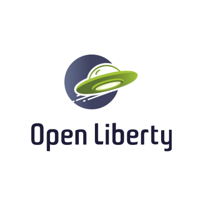
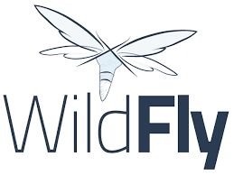
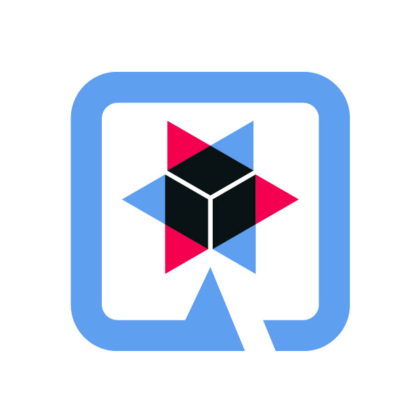
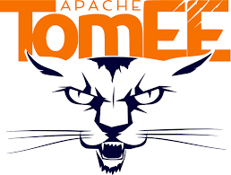

= Jakarta NoSQL samples code
:toc: auto

This documentation provides an overview of the integration between Eclipse JNoSQL and the Jakarta EE/MicroProfile platforms.
We will delve into the concepts and capabilities of Eclipse JNoSQL and explore its seamless integration with popular application servers
such as Open Liberty, Quarkus, and WildFly. These application servers are renowned for supporting Jakarta EE and MicroProfile specifications,
making them ideal choices for deploying enterprise-grade applications. By understanding the features and benefits of these platforms,
developers can leverage the power of JNoSQL to efficiently work with NoSQL databases within their Jakarta EE or MicroProfile applications.

== Open Liberty

Open Liberty is a lightweight and highly flexible open-source application server that supports the Jakarta EE and MicroProfile specifications. It offers a production-ready runtime environment focusing on rapid development and cloud-native deployments. Open Liberty provides extensive support for enterprise features like security, transactions, and messaging while ensuring a small footprint and fast startup times.

=== Projects

[cols="1,3,2"]
|===
| Module | Goal | Tech details

| link:liberty-mongodb/[]
| Simple CRUD REST application
a|
* MicroProfile:
    ** Runtime: Open Liberty;
* NoSQL database:
    ** MongoDB;

| link:jnosql-bean-validation/[]
|Simple CRUD REST application with Jakarta Bean Validation support
a|
* MicroProfile:
** Runtime: Open Liberty;
* Jakarta Bean Validation;
* NoSQL database:
** MongoDB;

|===

== Wildfly

WildFly, formerly JBoss Application Server, is an open-source, lightweight, and flexible application server built to support the Jakarta EE platform. It offers a complete Java EE-compatible runtime environment with a wide range of features and services required for enterprise-grade applications. WildFly strongly emphasizes standards compliance and provides extensive support for Jakarta EE specifications, making it a popular choice for Java developers.

=== Projects

[cols="1,3,2"]
|===
| Module | Goal | Tech details

| link:wildfly-mongodb/[]
| Simple CRUD REST application
a|
* Jakarta EE:
** Runtime: Wildfly;
* NoSQL database:
** MongoDB;

|===

== Quarkus

Quarkus is a modern Kubernetes-native Java framework designed for cloud-native application development. It aims to optimize developer productivity, resource utilization, and startup times without sacrificing the ability to write expressive and feature-rich applications. Quarkus has gained significant popularity in the MicroProfile community due to its impressive performance characteristics and developer-friendly features.

=== Projects

[cols="1,3,2"]
|===
| Module | Goal | Tech details

| link:quarkus-mongodb/[]
| Simple CRUD REST application
a|
* MicroProfile:
** Runtime: Quarkus;
* NoSQL database:
** MongoDB;

| link:quarkus-jnosql-mongodb/[]
| Simple CRUD REST application with Quarkus using Records as entity
a|
* MicroProfile:
** Runtime: Quarkus;
* NoSQL database:
** MongoDB;

|===

== Apache TomEE

Apache TomEE is a lightweight, open-source Jakarta EE application server that is built on top of Apache Tomcat. It provides a full Java EE stack implementation, allowing developers to deploy and run enterprise applications that adhere to the Jakarta EE specifications.

=== Projects

[cols="1,3,2"]
|===
| Module | Goal | Tech details

| link:tomee-jnosql-sample/[]
| Simple CRUD REST application
a|
* MicroProfile:
** Runtime: Apache TomEE;
* NoSQL database:
** MongoDB;

|===